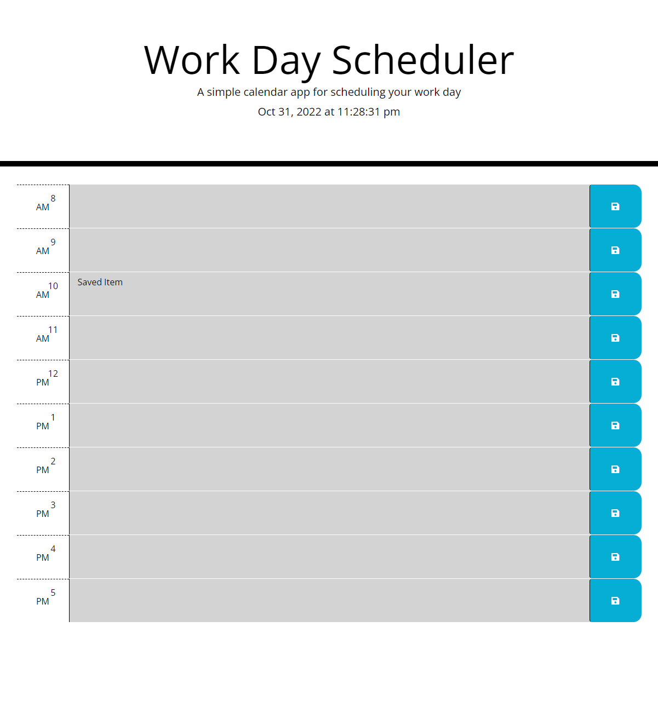

# Work-Day-Scheduler

# Description
This is a daily 8am - 5pm work schedule built by utilizing bootstrap and jquery. One can keep track of their daily task since the data is stored on the local storage

# How to use

Enter the text/item in the seleceted timeslot and click the save button.

# Screenshot

#URL

https://irie-i.github.io/Work-Day-Scheduler/

